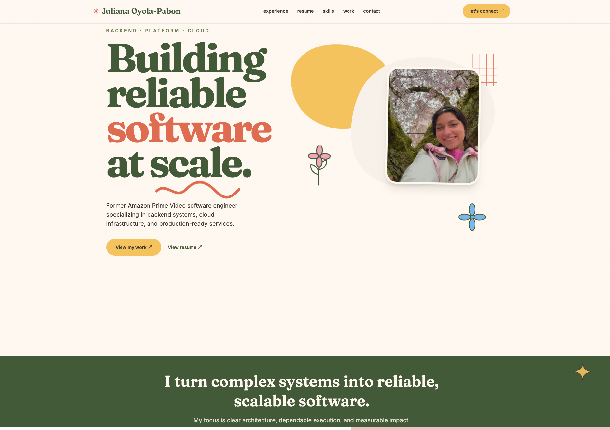
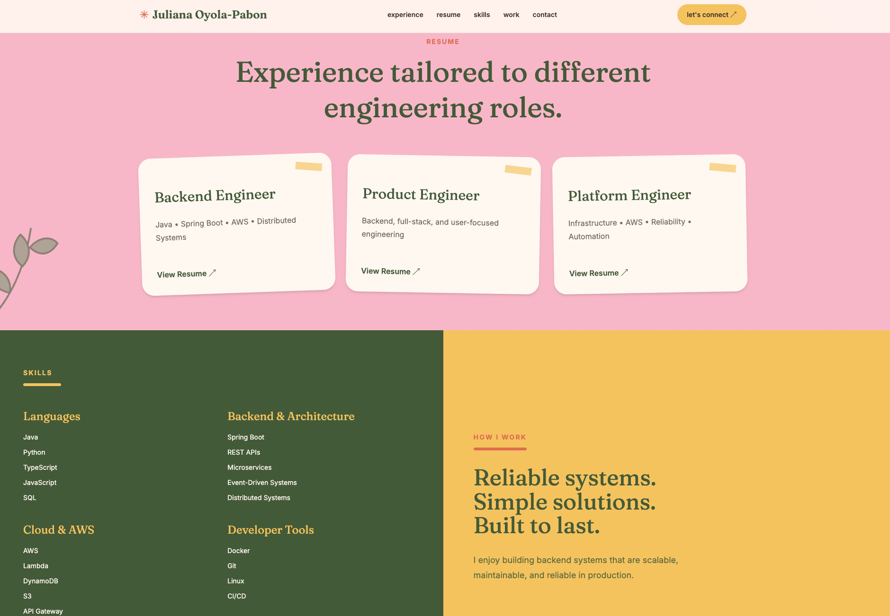

# Juliana Oyola-Pabon — Portfolio



A responsive software engineering portfolio showcasing my experience in backend engineering, cloud infrastructure, distributed systems, and production software development.

🌐 **Live Site:** https://juliana-portfolio-two.vercel.app

---

## Overview

This portfolio highlights my engineering experience, technical strengths, selected work, and role-specific resumes.

Designed with a focus on clean typography, subtle motion, accessibility, and responsive design.

## Preview



---

## Tech Stack

- Next.js
- React
- TypeScript
- Tailwind CSS
- Framer Motion
- Vercel

---

## Features

- Responsive design
- Mobile navigation
- Scroll animations
- Interactive project cards
- Engineering experience timeline
- Multiple tailored resumes
- Accessible motion support
- Automatic Vercel deployment

---

## Running Locally

```bash
git clone https://github.com/julsoyola/juliana-portfolio.git

cd juliana-portfolio

npm install

npm run dev
```

---

## Deployment

Automatically deployed with **Vercel** on every push to `main`.

---

## Contact

- Portfolio: https://juliana-portfolio-two.vercel.app
- LinkedIn: https://linkedin.com/in/julianaoyola
- GitHub: https://github.com/julsoyola